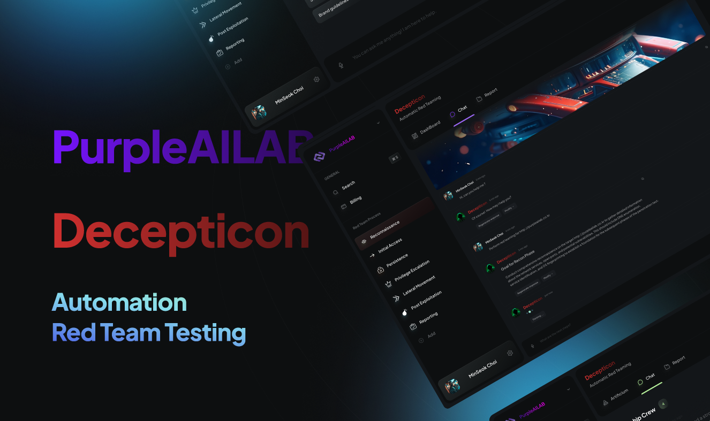

[](../README.md)
[](README_KO.md)

<h1 align="center"> Decepticon : Vibe Hacking Agent</h1>

<div align="center">
  <!-- GitHub License -->
  <a href="https://github.com/PurpleCHOIms/Decepticon/blob/main/LICENSE">
    
  </a>

  <!-- GitHub Stars -->
  <a href="https://github.com/PurpleCHOIms/Decepticon/stargazers">
    
  </a>

  <!-- GitHub Contributors -->
  <a href="https://github.com/PurpleCHOIms/Decepticon/graphs/contributors">
    
  </a>

  <br/>

  <!-- Discord -->
  <a href="https://discord.gg/TZUYsZgrRG">
    
  </a>

  <!-- Website -->
  <a href="https://purplelab.framer.ai">
    
  </a>

</div>


---


<br/>

---

<details>
<summary><strong>📚 목차</strong></summary>

- [💡 Vibe Hacking이란 무엇인가?](#-vibe-hacking이란-무엇인가)
- [💡 왜 Decepticon인가?](#-왜-decepticon인가)
- [🚀 빠른 시작](#-빠른-시작)
- [🤖 에이전트](#-에이전트)
  - [🔴 Red Team 에이전트](#-red-team-에이전트)
  - [🔵 유틸리티 에이전트](#-유틸리티-에이전트)
- [🏛️ 멀티 아키텍처](#️-멀티-아키텍처)
- [🔧 설치](#-설치)
- [🧠 고급 AI 모델](#-고급-ai-모델)
  - [☁️ 클라우드 모델](#️-클라우드-모델)
  - [🏠 로컬 모델 (Ollama)](#-로컬-모델-ollama)
- [🔧 MCP 지원](#-mcp-지원)
  - [✅ 지원하는 MCP 전송 방식](#-지원하는-mcp-전송-방식)
  - [📁 `mcp_config.json` 구조](#-mcp_configjson-구조)
  - [📌 예시](#-예시)
- [⚠️ 실험적 기술 면책 조항](#️-실험적-기술-면책-조항)
- [🤝 기여하기](#-기여하기)
  - [🔧 기여할 수 있는 것들](#-기여할-수-있는-것들)
    - [🛠 보안 도구를 MCP 형식으로 마이그레이션](#-보안-도구를-mcp-형식으로-마이그레이션)
    - [🧠 ReAct 스타일 Red Team 에이전트 개발](#-react-스타일-red-team-에이전트-개발)
    - [🕸 멀티 에이전트 플로우 설계](#-멀티-에이전트-플로우-설계)
  - [🚀 기여 방법](#-기여-방법)
  - [🌟 커뮤니티 참여](#-커뮤니티-참여)
- [📝 라이선스](#-라이선스)

</details>

---

## 💡 **Vibe Hacking**이란 무엇인가?

**Vibe Hacking**은 PurpleAILAB에서 정의한 공격적 보안(Offensive Security)의 새로운 패러다임입니다.

수동 실행에 의존하는 기존의 레드팀 방법론과 달리, Vibe Hacking에서는 **AI 에이전트가 자율적으로 레드팀 작업을 수행**합니다.

> ### *최고의 방어는 좋은 공격이다.*

## 💡 왜 **Decepticon**인가?

에이전트가 더욱 정교해짐에 따라 공격자들도 함께 진화합니다.  
AI 기반 피싱부터 자체 학습 악성코드까지, 공격 기법들은 점점 더 자동화되고 지능화되고 있습니다.

AI 기반 위협으로부터 효과적으로 방어하기 위해서는 **더 빨리 행동해야 하며**—그리고 **먼저 행동해야 합니다**.  
**Decepticon**은 바로 그 목적을 위해 설계되었습니다: 공격자들이 자동화하기 **전에** AI 에이전트를 사용하여 레드팀을 자동화하는 것입니다.

반복적이고 수동적인 작업은 에이전트에게 위임하고, 직관과 의사결정에 집중하여 진정한 **사이버보안 감독자**의 역할을 수행하세요.

> ### *AI가 먼저 해킹하기 전에 대비하라.*

---

## 🚀 빠른 시작

### 1. 환경 설정
```bash
uv pip install -e .
```

### 2. 환경 파일 복사 
```bash
cp .env.example .env
```

### 3. Docker 실행
```bash
docker-compose up -d
```

### 4. MCP 서버 실행
#### 옵션 1: 제공된 스크립트 사용
- Windows:
```bash
./run_mcp.ps1
```
- macOS/Linux:
```bash
./run_mcp.sh
```

#### 옵션 2: 수동 실행
```bash
python src/tools/mcp/Inital_Access.py
python src/tools/mcp/Recoonaissance.py
```

### 5. CLI 또는 웹 인터페이스 실행
```bash
python cli.py
streamlit run app.py
```

---

## 🤖 에이전트

#### 🔴 Red Team 에이전트
- **정찰 에이전트(Reconnaissance Agent)**: 네트워크 스캐닝, 서비스 열거, 취약점 발견
- **초기 접근 에이전트(Initial Access Agent)**: 익스플로잇, 자격 증명 공격, 시스템 침해
- **권한 상승 에이전트(Privilege Escalation Agent)**(계획됨): 권한 상승 및 측면 이동
- **방어 회피 에이전트(Defense Evasion Agent)**(계획됨): 탐지 방지 및 은밀 기법
- **지속성 에이전트(Persistence Agent)**(계획됨): 접근 유지 및 백도어 설치
- **실행 에이전트(Execution Agent)**(계획됨): 명령 실행 및 페이로드 배포

#### 🔵 유틸리티 에이전트 
- **계획 에이전트(Planner Agent)**: 전체 작업을 조율하는 전략적 두뇌
- **요약 에이전트(Summary Agent)**: 분석 편집, 보고서 작성 및 문서화
- **감독 에이전트(Supervisor Agent)**(계획됨): 워크플로 오케스트레이션 및 의사결정 라우팅

---

## 🏛️ 멀티 아키텍처

**유연한 아키텍처 옵션:**
- **Swarm 아키텍처**: 직접적인 P2P 에이전트 커뮤니케이션 및 협업
- **Supervisor 아키텍처**(계획됨): 감독자가 관리하는 워크플로우를 통한 중앙 집중식 제어
- **하이브리드 아키텍처**(계획됨): 직접 커뮤니케이션과 중앙 집중식 감독을 결합한 접근법
- **사용자 정의 아키텍처**

---

## 🔧 설치

### 1. **저장소 복제**
```bash
git clone https://github.com/PurpleCHOIms/Decepticon.git
cd Decepticon
```

### 2. **의존성 설치** (옵션 선택)
**UV (권장)**
```bash
# 가상환경 생성 및 의존성 설치
uv pip install -e .
```

### 3. 환경 파일 .env 설정

```bash
# 환경 파일 생성
cp .env.example .env
```

```bash
# API 키 설정

# LLM API
OPENAI_API_KEY=your-api-key
ANTHROPIC_API_KEY=your-api-key
OPENROUTER_API_KEY=your-api-key

# Langsmith
LANGSMITH_TRACING=true
LANGSMITH_ENDPOINT="https://api.smith.langchain.com"
LANGSMITH_API_KEY=your-api-key
LANGSMITH_PROJECT=Decepticon
LANGGRAPH_API_URL=http://127.0.0.1:2024
```

### 4. Docker 설정

```bash
# 타겟이 포함된 Kali Linux 컨테이너 시작
docker-compose up -d
```

### 5. MCP 서버 시작
- Windows:
```bash
./run_mcp.ps1
```
- macOS/Linux:
```bash
./run_mcp.sh
```

```bash
python src/tools/mcp/Inital_Access.py
python src/tools/mcp/Recoonaissance.py
```

### 6. CLI 실행
```bash
# 가상환경 활성화 (아직 활성화되지 않은 경우)
source .venv/bin/activate  # Windows: .venv\Scripts\activate

# CLI 실행
python cli.py
```

### 7. 웹 인터페이스

```bash
# 웹 인터페이스 실행
streamlit run app.py
```
**다음 주소에서 인터페이스에 접근:** http://localhost:8501

---

## 🧠 고급 AI 모델

**15개 이상의 AI 제공업체**와 **30개 이상의 모델** 지원:

### ☁️ 클라우드 모델
- **OpenAI**: GPT-4o, GPT-4o Mini, O1 Preview, O1 Mini
- **Anthropic**: Claude 3.5 Sonnet, Claude 3.5 Haiku, Claude 3.7 Sonnet
- **Google**: Gemini 2.0 Flash, Gemini 2.5 Pro  
- **Groq**: 초고속 Llama 4 모델 (Scout, Maverick)
- **Mistral**: Mistral Large, Mistral Small
- **xAI**: Grok Beta
- **Perplexity**: 웹 검색 기능이 있는 Sonar 모델

### 🏠 로컬 모델 (Ollama)
- **Meta**: Llama 3.3 70B, Llama 3.1 모델
- **DeepSeek**: DeepSeek-R1 변형  
- **Google**: Gemma 3 모델 (4B, 12B, 27B)
- **Alibaba**: Qwen 3 모델
- **Mistral**: Mistral Small 3.1 (24B)

---

## 🔧 MCP 지원

이 프로젝트는 [LangGraph MCP Adapter](https://github.com/langchain-ai/langchain-mcp-adapters)를 통한 도구 로딩을 지원합니다.

`mcp_config.json`이라는 설정 파일에서 MCP 도구를 정의할 수 있습니다.  
도구들은 **에이전트 이름**별로 그룹화되며, 각 에이전트는 여러 MCP 서버를 가질 수 있습니다.

### ✅ 지원하는 MCP 전송 방식

- `stdio` - 표준 입출력 통신
- `streamable_http` - HTTP 기반 스트리밍 통신

### 📁 `mcp_config.json` 구조

```json
{
  "agent_name": {
    "mcp_server_1": {
      "command": "python",
      "args": ["./path/to/script.py"],
      "transport": "stdio"
    },
    "another_mcp_server_streamable_HTTP": {
      "url": "https://your-cloud-function/mcp?api_key=your-api-key"
    }
  }
}
```

### 📌 예시

```json
{
  "reconnaissance": {
    "reconnaissance": {
      "command": "python",
      "args": ["./src/tools/mcp/Reconnaissance.py"],
      "transport": "stdio"
    },
    "desktop_commander": {
      "url": "https://server.smithery.ai/@wonderwhy-er/desktop-commander/mcp?api_key=your-api-key"
    }
  },
  "initial_access": {
    "initial_access": {
      "command": "python",
      "args": ["./src/tools/mcp/Initial_Access.py"],
      "transport": "stdio"
    }
  }
}
```

**새로운 MCP 도구를 추가하려면:**
1. `src/tools/mcp/` 아래에 MCP 도구 스크립트를 생성
2. `mcp_config.json`에 해당 항목을 추가
3. 새 도구를 로드하기 위해 애플리케이션을 재시작

---

## ⚠️ 실험적 기술 면책 조항

**Decepticon**은 현재 활발히 개발 중인 실험적 프로젝트입니다. 아직 안정적이지 않으며 버그, 불완전한 기능, 또는 중대한 변경사항이 포함될 수 있습니다.

우리는 커뮤니티와 함께 이 프로젝트를 공개적으로 구축하고 있으며 다음을 따뜻하게 환영합니다:

- 버그 리포트  
- 기능 요청  
- Pull 요청  
- 좋은 분위기  

이슈를 제출하거나 PR을 제출하여 Decepticon을 더 좋게 만드는 데 도움을 주세요 (기여 방법에 대해서는 아래 섹션을 참조하세요)!

---

## 🤝 기여하기

이 프로젝트를 더 좋고, 더 강력하고, 더 안전하게 만들기 위한 커뮤니티의 기여를 환영합니다.  
숙련된 개발자든, 보안 연구원이든, 오픈소스를 시작하는 단계든, 참여할 수 있는 많은 방법이 있습니다.

### 🔧 기여할 수 있는 것들

#### 🛠 보안 도구를 MCP 형식으로 마이그레이션

기존 보안 도구를 모듈형 LangGraph 호환 **MCP (Modular Command Protocol) 도구**로 변환하는 데 도움을 주세요.

- 표준 MCP 인터페이스(`stdio` 또는 `streamable_http`)를 사용하여 도구를 래핑
- `langgraph-mcp-adapter`와의 호환성 확보
- `src/tools/mcp/` 아래에 배치

#### 🧠 ReAct 스타일 Red Team 에이전트 개발

Red Team 작업을 위한 ReAct 스타일 에이전트를 설계하고 개선하세요:

- 정찰  
- 초기 접근  
- 권한 상승  
- 지속성 등

다음을 통해 기여할 수 있습니다:

- `src/prompts/` 아래에 맞춤형 프롬프트 생성
- 특정 기능을 가진 새로운 에이전트 구현
- 작업 계획 및 메모리 사용 개선

#### 🕸 멀티 에이전트 플로우 설계

멀티 에이전트 오케스트레이션 레이어의 설계 및 최적화에 기여하세요:

- 새로운 워크플로우 또는 에이전트 역할 제안
- 에이전트 간 커뮤니케이션 및 핸드오프 개선
- LangGraph를 사용한 상태 기반 로직 확장

### 🚀 기여 방법

1. 저장소를 포크
2. 새 브랜치 생성 (`git checkout -b feature/your-feature`)
3. 명확한 메시지와 함께 변경사항 커밋
4. 브랜치에 푸시하고 **Pull Request** 열기
5. 관련 이슈 연결(있는 경우) 및 솔루션 설명

문서화가 포함된 깔끔하고 잘 테스트된 코드를 권장합니다.  
PR을 시작하기 전에 아이디어를 논의하기 위해 이슈를 열어주세요!

### 🌟 커뮤니티 참여

당신의 기여는 차이를 만듭니다 — 버그 수정, 문서 개선, 새로운 도구 구축 등 무엇이든.  
PR이 병합되면 공식 기여자로 인정받게 됩니다! **AI 기반 레드팀**의 미래를 함께 구축해나가요.

---

## 📝 라이선스

이 저장소는 [Apache-2.0 License](../LICENSE)에 따라 라이선스가 부여됩니다.

---

